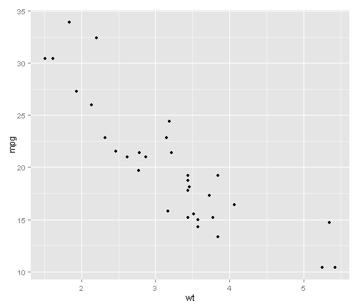

## Read-And-Delete

1. Edit YAML front matter
2. Write using R Markdown
3. Use an empty line followed by three dashes to separate slides!

--- .class #id 

## A simple table

<!-- html table generated in R 3.1.1 by xtable 1.7-3 package -->
<!-- Thu Aug 21 12:54:05 2014 -->
<TABLE border=1>
<TR> <TH>  </TH> <TH> mpg </TH> <TH> cyl </TH> <TH> disp </TH> <TH> hp </TH> <TH> drat </TH> <TH> wt </TH> <TH> qsec </TH> <TH> vs </TH> <TH> am </TH> <TH> gear </TH> <TH> carb </TH>  </TR>
  <TR> <TD align="right"> Mazda RX4 </TD> <TD align="right"> 21.00 </TD> <TD align="right"> 6.00 </TD> <TD align="right"> 160.00 </TD> <TD align="right"> 110.00 </TD> <TD align="right"> 3.90 </TD> <TD align="right"> 2.62 </TD> <TD align="right"> 16.46 </TD> <TD align="right"> 0.00 </TD> <TD align="right"> 1.00 </TD> <TD align="right"> 4.00 </TD> <TD align="right"> 4.00 </TD> </TR>
  <TR> <TD align="right"> Mazda RX4 Wag </TD> <TD align="right"> 21.00 </TD> <TD align="right"> 6.00 </TD> <TD align="right"> 160.00 </TD> <TD align="right"> 110.00 </TD> <TD align="right"> 3.90 </TD> <TD align="right"> 2.88 </TD> <TD align="right"> 17.02 </TD> <TD align="right"> 0.00 </TD> <TD align="right"> 1.00 </TD> <TD align="right"> 4.00 </TD> <TD align="right"> 4.00 </TD> </TR>
  <TR> <TD align="right"> Datsun 710 </TD> <TD align="right"> 22.80 </TD> <TD align="right"> 4.00 </TD> <TD align="right"> 108.00 </TD> <TD align="right"> 93.00 </TD> <TD align="right"> 3.85 </TD> <TD align="right"> 2.32 </TD> <TD align="right"> 18.61 </TD> <TD align="right"> 1.00 </TD> <TD align="right"> 1.00 </TD> <TD align="right"> 4.00 </TD> <TD align="right"> 1.00 </TD> </TR>
  <TR> <TD align="right"> Hornet 4 Drive </TD> <TD align="right"> 21.40 </TD> <TD align="right"> 6.00 </TD> <TD align="right"> 258.00 </TD> <TD align="right"> 110.00 </TD> <TD align="right"> 3.08 </TD> <TD align="right"> 3.21 </TD> <TD align="right"> 19.44 </TD> <TD align="right"> 1.00 </TD> <TD align="right"> 0.00 </TD> <TD align="right"> 3.00 </TD> <TD align="right"> 1.00 </TD> </TR>
  <TR> <TD align="right"> Hornet Sportabout </TD> <TD align="right"> 18.70 </TD> <TD align="right"> 8.00 </TD> <TD align="right"> 360.00 </TD> <TD align="right"> 175.00 </TD> <TD align="right"> 3.15 </TD> <TD align="right"> 3.44 </TD> <TD align="right"> 17.02 </TD> <TD align="right"> 0.00 </TD> <TD align="right"> 0.00 </TD> <TD align="right"> 3.00 </TD> <TD align="right"> 2.00 </TD> </TR>
  <TR> <TD align="right"> Valiant </TD> <TD align="right"> 18.10 </TD> <TD align="right"> 6.00 </TD> <TD align="right"> 225.00 </TD> <TD align="right"> 105.00 </TD> <TD align="right"> 2.76 </TD> <TD align="right"> 3.46 </TD> <TD align="right"> 20.22 </TD> <TD align="right"> 1.00 </TD> <TD align="right"> 0.00 </TD> <TD align="right"> 3.00 </TD> <TD align="right"> 1.00 </TD> </TR>
   </TABLE>

---

## A simple plot


```r
require(ggplot2)
qplot(wt,mpg,data=mtcars)
```



---

## Interactive plot 1

<iframe src=' assets/fig/unnamed-chunk-3.html ' scrolling='no' frameBorder='0' seamless class='rChart leaflet ' id=iframe- chartf3845e279a0 ></iframe> <style>iframe.rChart{ width: 100%; height: 400px;}</style>

---

## Interactive plot 2

<!DOCTYPE html PUBLIC "-//W3C//DTD XHTML 1.0 Strict//EN"
  "http://www.w3.org/TR/xhtml1/DTD/xhtml1-strict.dtd">
<html xmlns="http://www.w3.org/1999/xhtml">
<head>
<title>MotionChartIDe2443ca3d08</title>
<meta http-equiv="content-type" content="text/html;charset=utf-8" />
<style type="text/css">
body {
  color: #444444;
  font-family: Arial,Helvetica,sans-serif;
  font-size: 75%;
  }
  a {
  color: #4D87C7;
  text-decoration: none;
}
</style>
</head>
<body>
 <!-- MotionChart generated in R 3.1.1 by googleVis 0.5.5 package -->
<!-- Thu Aug 21 12:57:33 2014 -->


<!-- jsHeader -->
<script type="text/javascript">
 
// jsData 
function gvisDataMotionChartIDe2443ca3d08 () {
var data = new google.visualization.DataTable();
var datajson =
[
 [
 "Apples",
2008,
"West",
98,
78,
20,
"2008-12-31" 
],
[
 "Apples",
2009,
"West",
111,
79,
32,
"2009-12-31" 
],
[
 "Apples",
2010,
"West",
89,
76,
13,
"2010-12-31" 
],
[
 "Oranges",
2008,
"East",
96,
81,
15,
"2008-12-31" 
],
[
 "Bananas",
2008,
"East",
85,
76,
9,
"2008-12-31" 
],
[
 "Oranges",
2009,
"East",
93,
80,
13,
"2009-12-31" 
],
[
 "Bananas",
2009,
"East",
94,
78,
16,
"2009-12-31" 
],
[
 "Oranges",
2010,
"East",
98,
91,
7,
"2010-12-31" 
],
[
 "Bananas",
2010,
"East",
81,
71,
10,
"2010-12-31" 
] 
];
data.addColumn('string','Fruit');
data.addColumn('number','Year');
data.addColumn('string','Location');
data.addColumn('number','Sales');
data.addColumn('number','Expenses');
data.addColumn('number','Profit');
data.addColumn('string','Date');
data.addRows(datajson);
return(data);
}
 
// jsDrawChart
function drawChartMotionChartIDe2443ca3d08() {
var data = gvisDataMotionChartIDe2443ca3d08();
var options = {};
options["width"] =    600;
options["height"] =    400;

    var chart = new google.visualization.MotionChart(
    document.getElementById('MotionChartIDe2443ca3d08')
    );
    chart.draw(data,options);
    

}
  
 
// jsDisplayChart
(function() {
var pkgs = window.__gvisPackages = window.__gvisPackages || [];
var callbacks = window.__gvisCallbacks = window.__gvisCallbacks || [];
var chartid = "motionchart";
  
// Manually see if chartid is in pkgs (not all browsers support Array.indexOf)
var i, newPackage = true;
for (i = 0; newPackage && i < pkgs.length; i++) {
if (pkgs[i] === chartid)
newPackage = false;
}
if (newPackage)
  pkgs.push(chartid);
  
// Add the drawChart function to the global list of callbacks
callbacks.push(drawChartMotionChartIDe2443ca3d08);
})();
function displayChartMotionChartIDe2443ca3d08() {
  var pkgs = window.__gvisPackages = window.__gvisPackages || [];
  var callbacks = window.__gvisCallbacks = window.__gvisCallbacks || [];
  window.clearTimeout(window.__gvisLoad);
  // The timeout is set to 100 because otherwise the container div we are
  // targeting might not be part of the document yet
  window.__gvisLoad = setTimeout(function() {
  var pkgCount = pkgs.length;
  google.load("visualization", "1", { packages:pkgs, callback: function() {
  if (pkgCount != pkgs.length) {
  // Race condition where another setTimeout call snuck in after us; if
  // that call added a package, we must not shift its callback
  return;
}
while (callbacks.length > 0)
callbacks.shift()();
} });
}, 100);
}
 
// jsFooter
</script>
 
<!-- jsChart -->  
<script type="text/javascript" src="https://www.google.com/jsapi?callback=displayChartMotionChartIDe2443ca3d08"></script>
 
<!-- divChart -->
  
<div id="MotionChartIDe2443ca3d08" 
  style="width: 600; height: 400;">
</div>
 <div><span>Data: Fruits &#8226; Chart ID: <a href="Chart_MotionChartIDe2443ca3d08.html">MotionChartIDe2443ca3d08</a> &#8226; <a href="https://github.com/mages/googleVis">googleVis-0.5.5</a></span><br /> 
<!-- htmlFooter -->
<span> 
  R version 3.1.1 (2014-07-10) 
  &#8226; <a href="https://developers.google.com/terms/">Google Terms of Use</a> &#8226; <a href="https://google-developers.appspot.com/chart/interactive/docs/gallery/motionchart">Documentation and Data Policy</a>
</span></div>
</body>
</html>
