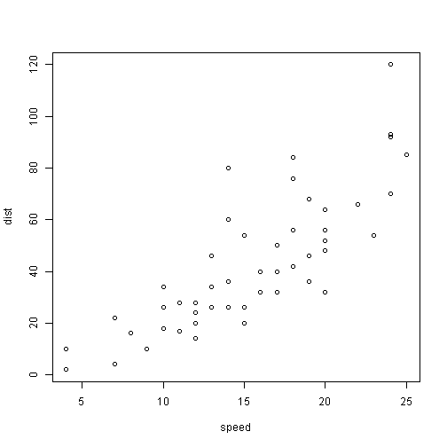

rPresentation
========================================================
author: Ivan Liu
date: 01/08/2014

First Slide
========================================================

For more details on authoring R presentations click the
**Help** button on the toolbar.

- Bullet 1
- Bullet 2
- Bullet 3

Slide With Code
========================================================


```r
require(rCharts)
nPlot(mpg ~ wt, data = mtcars, type = 'scatterChart')
```

```
<iframe src=' rPresentation-figure/unnamed-chunk-1.html ' scrolling='no' frameBorder='0' seamless class='rChart nvd3 ' id=iframe- chart8cc5d84c9c ></iframe> <style>iframe.rChart{ width: 100%; height: 400px;}</style>
```

Slide With Plot
========================================================

 
